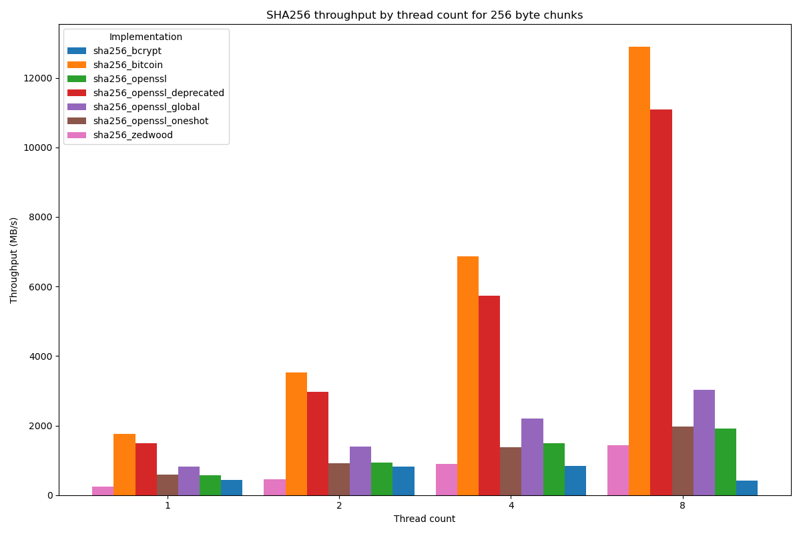
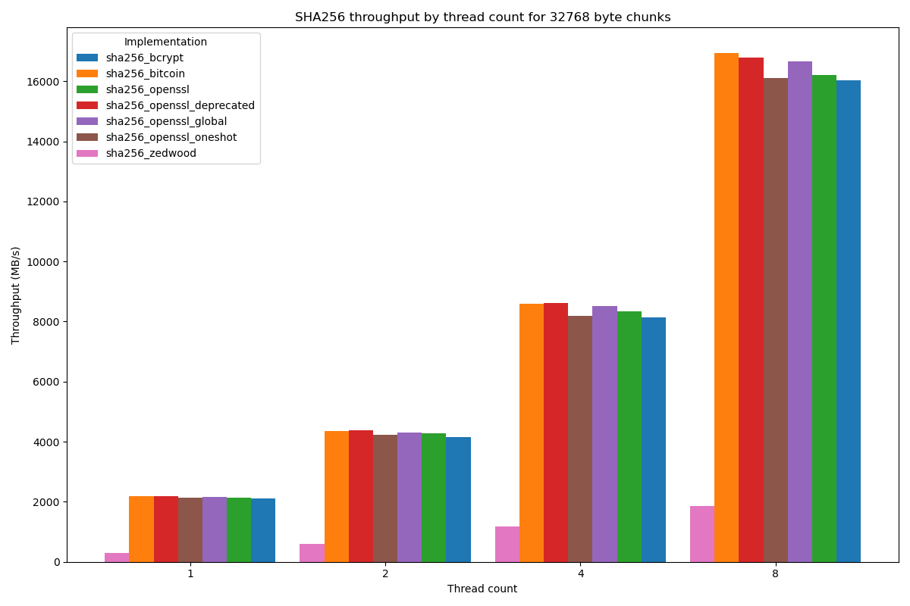
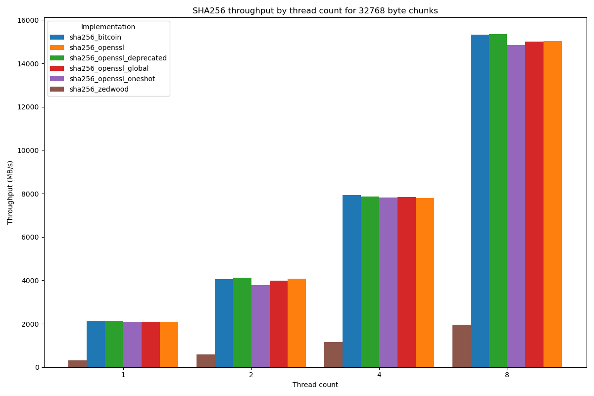
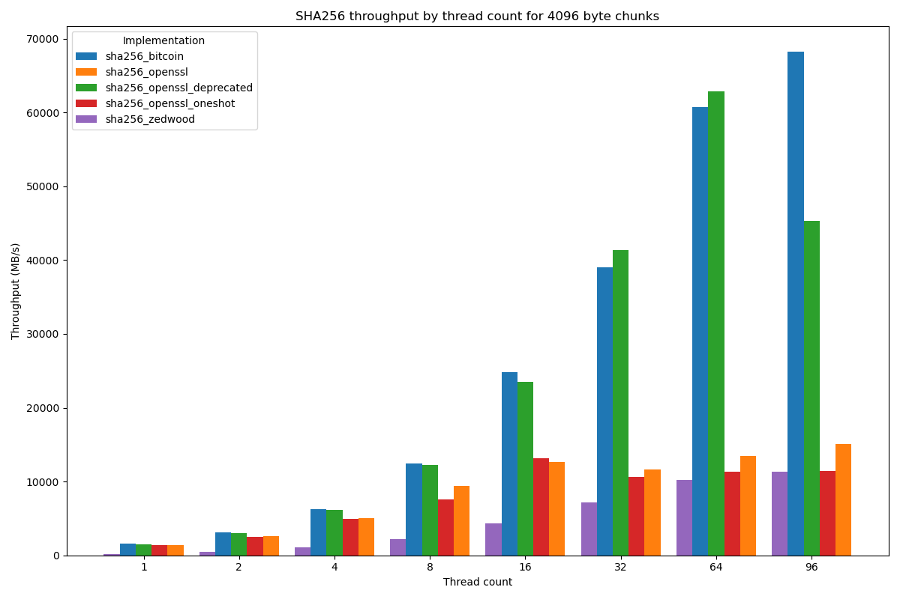

# SHA256 Hashing Performance Comparison

This repository benchmarks various SHA256 hashing implementations, comparing their performance across different data sizes and thread counts using the Google benchmark library.

SHA256 is a hashing algorithm widely used for file integrity checks, Merkle tree construction and more. For some use cases, it is desirable to quickly compute a SHA256 value for rather small chunks of bytes. 
Modern processors often support instructions to accelerate SHA256 hashing.

The following SHA256 hashing implementations are benchmarked:

| Name                                               | Uses intrinsics | References                                                                                                 |
| -------------------------------------------------- | --------------- | ---------------------------------------------------------------------------------------------------------- |
| zedwood                                            | No              | [zedwood](http://www.zedwood.com/article/cpp-sha256-function), [Olivier Gay](https://github.com/ogay/sha2) |
| bcrypt                                             | Yes             | [Win32 API bcrypt.h](https://learn.microsoft.com/en-us/windows/win32/api/bcrypt/)                          |
| bitcoin                                            | Yes             | [bitcoin source code](https://github.com/bitcoin/bitcoin/tree/master/src/crypto)                           |
| openssl deprecated                                 | Yes             | [OpenSSL API, deprecated](https://docs.openssl.org/master/man3/SHA256_Init/)                               |
| openssl oneshot                                    | Yes             | [OpenSSL API](https://docs.openssl.org/master/man3/SHA256_Init/#synopsis)                                  |
| openssl (EVP digest)                               | Yes             | [OpenSSL API](https://docs.openssl.org/master/man7/ossl-guide-libcrypto-introduction)                      |
| openssl global (EVP digest, single explicit fetch) | Yes             | [OpenSSL API](https://docs.openssl.org/master/man7/ossl-guide-libcrypto-introduction)                      |

# Results

## AMD Ryzen 7 5800X3D on Windows

Compiled using Clang 17.0.6

## AMD Ryzen 7 7840HS on Linux

Compiled using GCC 14.2.1

## 2x Intel Xeon Platinum 8468 on Linux

Compiled using Clang 18.1.8

# Key Takeaways

Always make sure to use an implementation that supports intrinsics when they are available.

If you require high performance for small chunks of data, use an implementation supporting intrinsics and without heap allocation or other shared global state.

For chunks with at least around 32768 bytes, you can get excellent performance by using the Win32 API or any OpenSSL API.

# TODO

Potentially interesting SHA256 implementations to try

https://github.com/minio/sha256-simd

https://github.com/intel/intel-ipsec-mb

